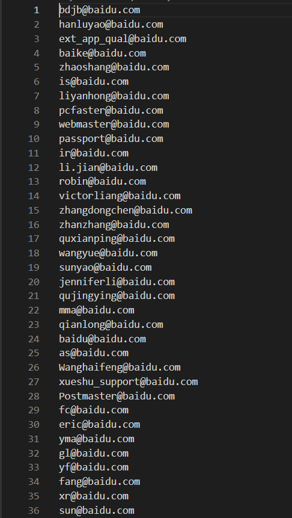

原理：借助snov.io收集指定域名的邮箱

使用：直接用大佬开发的工具snov.py，执行命令如下
```
python3.exe .\snov.py -u 注册时的邮箱 -p 注册时的密码 -t baidu.com
```
共收集到7898个邮箱，部分结果示例如下图  
  

参考链接：  
https://mp.weixin.qq.com/s/9QgYM3DU-93ODYDsTPUAxw
